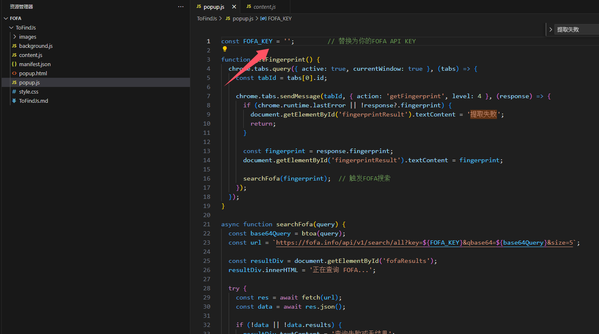
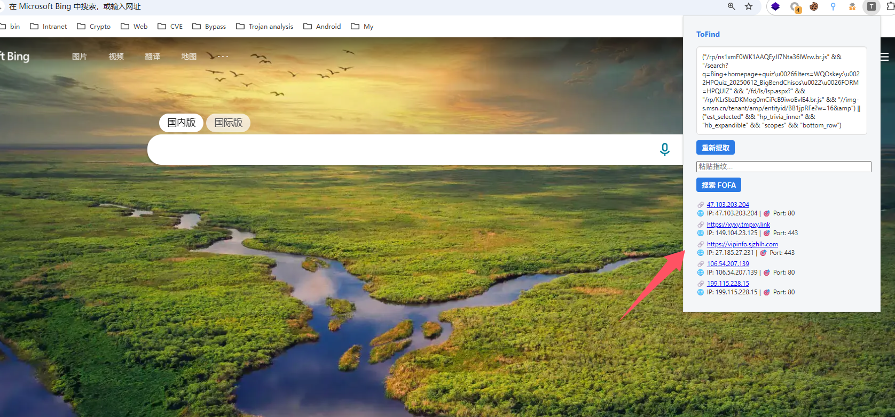

# ToFindJs

同源码网站收集工具 发现网站特征指纹，通过`Fofa`搜寻同源网站(`ToFind`的`js`版本)

## 摘要

这是一个发现网站指纹的浏览器插件，依据`css`、`Api`等来发现网站指纹，可以调用`Fofa Api`搜索同源网站

## 食用方式

### 0x01

可以在`popup.js`设置`FOFA_KEY`来搜索同源网站

### 0x02

在扩展中加载扩展文件夹后可以出现`ToFind`扩展

### 0x03

在一个网站标签页中打开`ToFind`扩展，可以显示提取的指纹，如果设置了`FoFa api`后可以出现`5`条同源的数据

